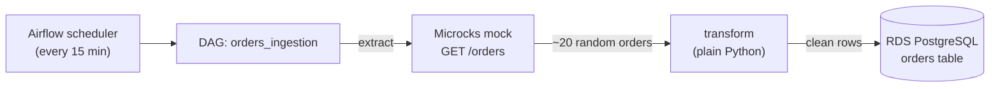

# Wiliot DevOps Assignment

Two parts:

1. **Task 1** — build the AWS infrastructure with Terraform (VPC, EKS, ECR, RDS, IAM).
2. **Task 2** — run a small data pipeline on it: Airflow pulls dummy data from a Microcks
   mock API, cleans it, and writes it into the RDS database.

> Before running any command below, set your profile and point kubectl at the cluster:
> ```bash
> export AWS_PROFILE=nofar-yaba AWS_REGION=us-east-1
> aws eks update-kubeconfig --name wiliot-dev --region us-east-1
> ```

---

# Task 1 — Infrastructure (Terraform)

## Resources

I split each resource into its own module so they're reusable, and wired them together
in `environments/dev/`.

| Resource | Module | What it is |
|---|---|---|
| **VPC** | `modules/network` | VPC (`10.0.0.0/16`), 2 public + 2 private subnets over 2 AZs, internet gateway, one NAT gateway, route tables |
| **EKS** | `modules/eks` | Cluster `wiliot-dev` (K8s 1.31) + a node group of 2× t3.medium |
| **RDS** | `modules/rds` | Private PostgreSQL, its subnet group, its security group, a generated password |
| **ECR** | `modules/ecr` | Image repositories + a lifecycle policy |
| **IAM** | `modules/iam` | The roles EKS needs (control plane + worker nodes) |

Deployed to AWS account `092988563851`, region `us-east-1`.

```
network ──► eks ──► rds        iam ──► eks
   └──────► rds                ecr (on its own)
```

## Considerations

- **One module per resource.** Keeps things reusable and easy to read. `network`, `iam`
  and `ecr` don't depend on anything, so they go first. `eks` needs the network and the
  IAM roles. `rds` needs the network and the cluster's security group.
- **Each security group lives with the thing it protects.** The RDS security group is
  inside the `rds` module and only allows port 5432 coming from the EKS cluster's
  security group. So the database can only be reached from inside the cluster, nothing else.
- **The database is private** — no public access, and encrypted at rest.
- **No passwords in the code.** The DB password is generated by Terraform and only lives in
  the state file (encrypted, in S3). Read it with `terraform output -raw rds_password`.
  In a real setup I'd put it in Secrets Manager, but the assignment user can't create secrets there.
- **State is remote** — kept in an S3 bucket (`wiliot-tfstate-092988563851`) with locking.
- **One tag on everything** — `team = devops`, set once on the provider, so cost tracking is easy.
- **Kept it cheap** — one NAT gateway, small DB, 2 small nodes. Fine for a demo; in prod
  I'd scale these up.
- **Ready for more than one cluster** — the network is a separate module, so I can add a
  second EKS cluster on the same VPC later without touching the network code.

### Run / check Task 1

```bash
cd environments/dev
terraform init
terraform plan
terraform apply
terraform output                 # cluster endpoint, ECR URLs, rds_endpoint, ...
terraform output -raw rds_password
```

---

# Task 2 — Data pipeline (Microcks + Airflow)

## The goal

Every 15 minutes, Airflow asks Microcks for some fake orders, cleans them up in Python,
and saves them into the RDS `orders` table.



## What each part does

| Part | Where | What it does |
|---|---|---|
| **Microcks** | `microcks` namespace | A fake API. Serves `GET /orders` and returns ~20 random orders each time (defined in `mocks/orders-openapi.yaml`). Auth is off and its database is throwaway — demo settings. |
| **Airflow** | `airflow` namespace | The scheduler. It runs the DAG on a timer, parses the DAG file, and shows the UI (which I exposed with a load balancer). |
| **The DAG** `orders_ingestion` | `dags/ingestion_dag.py` | The actual job, in 3 steps: `extract` (call the mock) → `transform` (clean the data) → `load` (write to RDS). Safe to re-run — it won't create duplicates. |
| **How the DAG gets in** | ConfigMap `airflow-dags` | I pack the DAG file into a ConfigMap and mount it into Airflow. No git-sync, no extra image — simplest thing that works. |
| **RDS connection** | Secret `rds-connection` | The database connection string, handed to Airflow as a secret. The DAG uses it by name (`rds_postgres`) so no password sits in the code. |

## Deploy it

```bash
make deploy    # install Microcks -> load the mock -> pack the DAG -> mount it into Airflow
```

(or one at a time: `make microcks`, `make mock`, `make dags`, `make airflow-upgrade`)

## How to look at things

### The Airflow UI (see the DAG and its runs)
```bash
kubectl -n airflow get svc airflow-api-server \
  -o jsonpath='{.status.loadBalancer.ingress[0].hostname}'; echo
# open http://<that-hostname>:8080   (login: admin / admin)
```

### The DAG (from the terminal)
```bash
# is it there? any errors reading it?
kubectl -n airflow exec deploy/airflow-scheduler -c scheduler -- airflow dags list
kubectl -n airflow exec deploy/airflow-scheduler -c scheduler -- airflow dags list-import-errors

# the DAG file that's actually mounted
kubectl -n airflow exec deploy/airflow-dag-processor -c dag-processor -- ls -la /opt/airflow/dags
```

### What's running (pods)
```bash
kubectl -n airflow  get pods     # api-server, scheduler, dag-processor, postgres (+ task pods)
kubectl -n microcks get pods     # microcks, mongodb, postman-runtime
```

### Run it and watch it
```bash
kubectl -n airflow exec deploy/airflow-scheduler -c scheduler -- airflow dags unpause orders_ingestion
kubectl -n airflow exec deploy/airflow-scheduler -c scheduler -- airflow dags trigger orders_ingestion

# see how the last runs went
kubectl -n airflow exec deploy/airflow-scheduler -c scheduler -- airflow dags list-runs -d orders_ingestion
```
Each step runs in its own pod — you can watch them pop up:
```bash
kubectl -n airflow get pods -w | grep orders-ingestion
```

### Logs
```bash
kubectl -n airflow logs deploy/airflow-scheduler     -c scheduler
kubectl -n airflow logs deploy/airflow-dag-processor -c dag-processor
# per-task logs are easier to read in the UI: click a task -> Logs
```

### The fake data source (Microcks)
```bash
kubectl -n microcks port-forward svc/microcks 8585:8080 &
curl -s http://localhost:8585/rest/Orders/1.0.0/orders | jq '.[0]'   # one random order
# Microcks UI: open http://localhost:8585
```

### The data that landed in RDS (the point of the whole thing)
```bash
kubectl -n airflow exec deploy/airflow-scheduler -c scheduler -- python -c \
"from airflow.providers.postgres.hooks.postgres import PostgresHook; \
h=PostgresHook('rds_postgres'); \
print('rows =', h.get_first('SELECT count(*) FROM orders')); \
print('sample =', h.get_records('SELECT order_id, customer, amount FROM orders LIMIT 3'))"
```

## Clean up

```bash
make clean                                  # removes only Microcks + the DAG
cd environments/dev && terraform destroy    # tears down all the AWS infra
```
